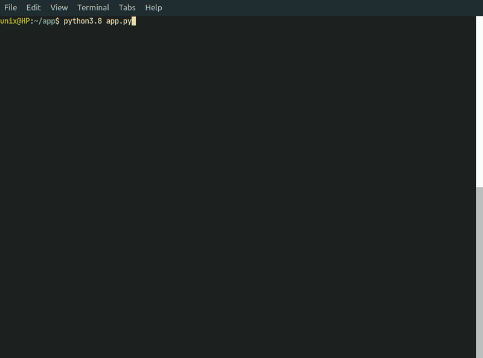
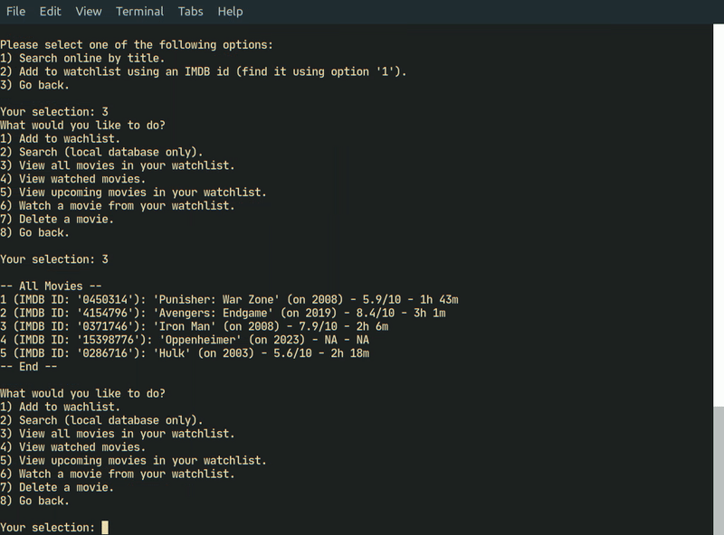
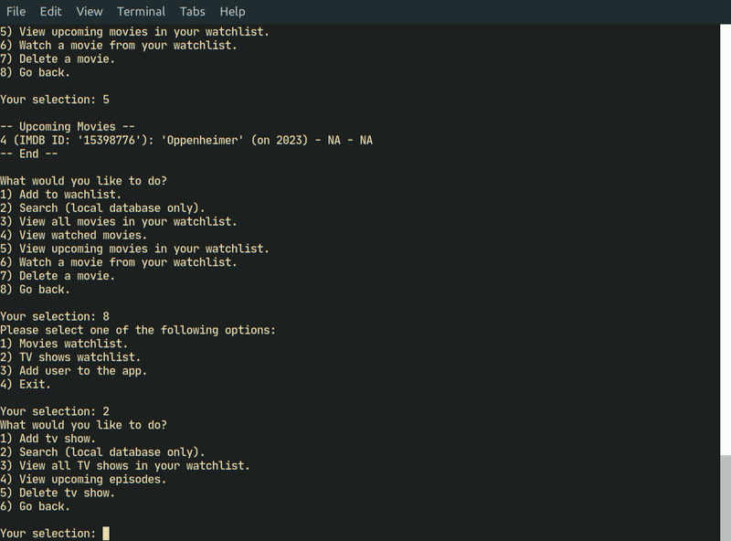

[](https://opensource.org/licenses/MIT) [](https://www.python.org/downloads/release/python-380/) [](https://img.shields.io/github/issues/pejmanmemar/MyWatchlist.svg)

# My Watchlist
Introducing **My Watchlist**, a mini CLI app for movie and TV show enthusiasts!  Built with Python and SQLite, "My Watchlist" allows you to keep track of your favorite movies or TV shows, and stay up-to-date with new releases and upcoming episodes.

Some of the exciting features offered by "My Watchlist" include:

- Quick and convenient online search by title or IMDB ID, with the app scraping information from IMDB
- Easy addition of movies or TV shows to your watchlist using IMDB IDs
- Intuitive interface for viewing and managing your watchlist, including the ability to store, view, and delete information
- Support for multiple users, so everyone in your household can have their own personalized watchlist

Don't miss out on the opportunity to streamline your entertainment experience with "My Watchlist" – give it a try today!


# Installation
Before getting started with "My Watchlist", make sure you have the following prerequisites installed:

- Python 3.8 or higher
- Pip
- Git

To install My Watchlist, follow these steps:

1. Clone the repository to the desired directory: ```git clone https://github.com/pejmanmemar/MyWatchlist.git```
2. Change into the MyWatchlist directory: ```cd MyWatchlist```
3. Install the required dependencies: ```pip install -r requirements.txt```
4. Run the app:
```
> cd src/
> python3.8 app.py
```

# Demo
In this demo, you will see:
- Search for a movie using the app
- Add the movie to your watchlist



- View watched movies for a specific user



- View list of TV shows and upcoming episodes


